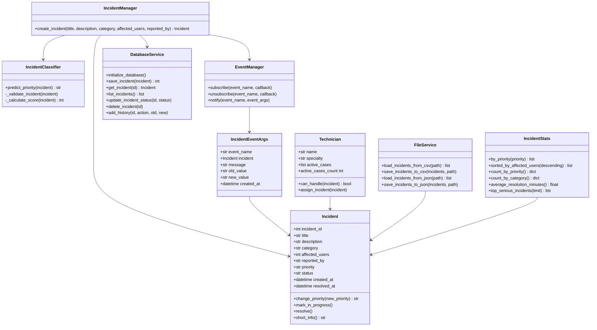
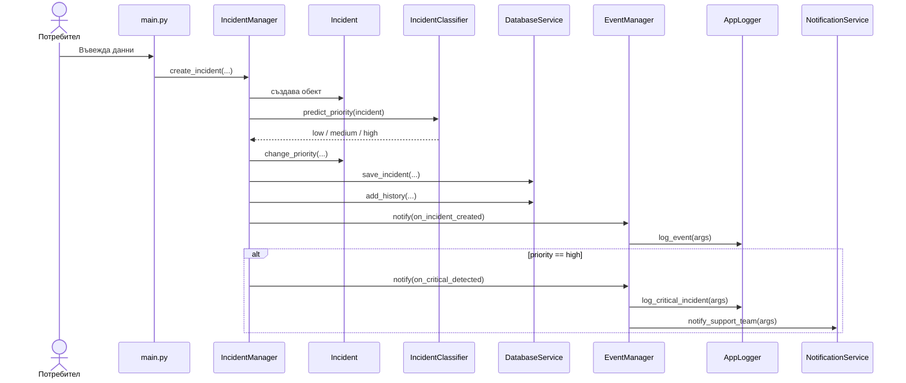
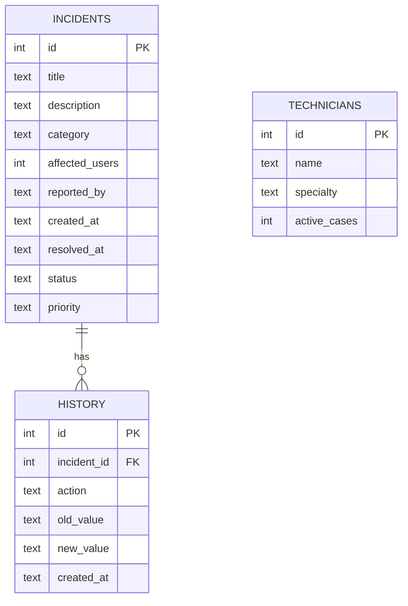
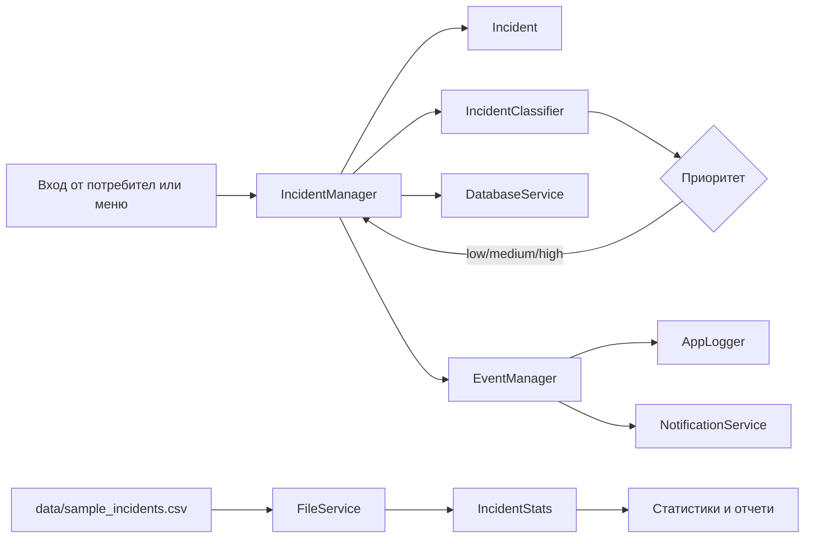
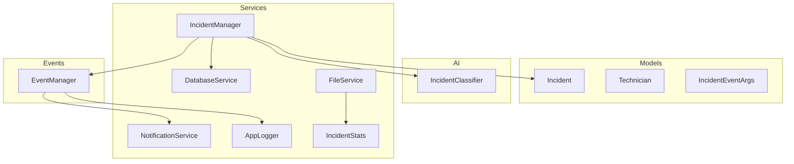

# Училищен проект по ООП

**Тема:** AI система за управление на инциденти  
**Предмет:** Обектно-ориентирано програмиране / Програмиране на ИИ  
**Изготвил:** Емил Николаев Спасов  
**Клас:** XI в клас  
**Професия:** Програмист на изкуствен интелект  
**Учебна година:** 2025/2026  
**Град:** Варна  
**Година:** 2026 г.

## Съдържание

1. Увод  
2. Анализ на проблема  
3. Проучване и използване на изкуствен интелект  
4. Анализ и проектиране на системата  
5. Архитектура на решението  
6. Реализация  
7. Тестване  
8. Анализ на резултатите  
9. Заключение  
10. Използвана литература  
11. Приложения

## 1. Увод

### 1.1. Актуалност на темата

В съвременните организации почти всяка дейност зависи от информационни системи: вътрешни мрежи, бази данни, уеб приложения, потребителски акаунти, хардуер, облачни услуги и системи за сигурност. Когато възникне проблем, той вече не е просто техническа неудобност. Един инцидент може да спре продажби, заявки, производство, учебен процес или комуникация между служители. Затова управлението на инциденти е важна част от IT Service Management практиките.

Темата е актуална, защото показва как може да се създаде малка, но реалистична система, която не само записва проблеми, а и помага за тяхното приоритизиране. При много постъпили сигнали е важно първо да се обработят тези, които засягат повече потребители или критични услуги. Например проблем с принтер засяга малка група, докато спиране на база данни може да блокира цяла организация.

В проекта се използва AI компонент под формата на rule-based класификатор. Това е подходящо за учебна система, защото решението е прозрачно: всяка прогноза може да бъде обяснена чрез точки, категории и ключови думи. Така проектът демонстрира както ООП принципи, така и практична AI логика, без да разчита на готов copy-paste модел.

### 1.2. Цел на проекта

Целта на проекта е разработване на Python приложение за управление на IT инциденти чрез използване на обектно-ориентирано програмиране, събитийно програмиране, файлове, база данни и AI логика за автоматично определяне на приоритет.

Системата трябва да може да създава инциденти, да предсказва техния приоритет (`low`, `medium`, `high`), да записва данни в SQLite база, да зарежда примерни данни от CSV, да извежда статистики и да уведомява други компоненти чрез Observer pattern.

### 1.3. Задачи за изпълнение

- Проучване на предметната област и реални системи за управление на инциденти.
- Анализ на функционални и нефункционални изисквания.
- Проектиране на класове, отговорности и връзки между обектите.
- Реализация на модели, услуги, AI класификатор, event dispatcher и слушатели.
- Реализация на SQLite база с таблици `incidents`, `technicians` и `history`.
- Реализация на четене от CSV и запис/четене на JSON.
- Реализация на LINQ-подобен анализ чрез `filter`, `map`, `reduce`, `sorted`, `Counter` и `groupby`.
- Реализация на custom exceptions за по-ясна обработка на грешки.
- Създаване на автоматична демонстрация и интерактивно меню.
- Тестване с unit тестове.
- Изготвяне на документация и финална презентация.

## 2. Анализ на проблема

### 2.1. Описание на предметната област

Системата решава проблема с регистриране, класифициране и проследяване на IT инциденти. Инцидент е непланиран проблем, който нарушава нормалната работа на услуга, устройство, мрежа, софтуер или потребителски достъп. В реална организация такива инциденти се обработват от help desk, системни администратори, мрежови специалисти или екип по информационна сигурност.

Основните потребители на системата са:

- служител или потребител, който докладва проблем;
- оператор/help desk специалист, който въвежда инцидента;
- техник, който поема конкретен случай;
- администратор, който следи статистика и история;
- екип за поддръжка, който трябва да бъде уведомен при критичен инцидент.

Процесите, които се автоматизират, са:

- въвеждане на инцидент;
- автоматично определяне на приоритет;
- записване на инцидента в база данни;
- изпращане на събития към логър и уведомителна услуга;
- анализ на примерни данни;
- извеждане на справки по приоритет, категория и време за решаване.

### 2.2. Анализ на съществуващи решения

| Система | Предназначение | Предимства | Недостатъци |
| --- | --- | --- | --- |
| ServiceNow IT Service Management | Платформа за ITSM процеси, включително incident management, автоматизация и работни потоци. | Подходяща за големи организации, предлага интеграции, автоматизация и централизирани процеси. | Сложна за внедряване, изисква обучение и е по-тежка от нужното за малък учебен проект. |
| Jira Service Management | Help desk и ITSM система за заявки, инциденти, ескалации и екипна работа. | Добра интеграция с Jira/Confluence, работни потоци, опашки и automation правила. | Комерсиална система, има много настройки и не е фокусирана върху показване на ООП структура за учебна цел. |

Изводът от проучването е, че реалните решения използват сходни идеи: заявки/инциденти, приоритети, история, ескалации, уведомяване и отчети. Учебният проект реализира по-малка версия на тези идеи, но с ясно разделение на класове и обекти.

### 2.3. Изисквания към системата

#### Функционални изисквания

| № | Изискване | Реализация |
| --- | --- | --- |
| F1 | Създаване на нов инцидент | `IncidentManager.create_incident` |
| F2 | Автоматична класификация на приоритет | `IncidentClassifier.predict_priority` |
| F3 | Запис в база данни | `DatabaseService.save_incident` |
| F4 | История на действията | `DatabaseService.add_history` |
| F5 | Събития при важни действия | `EventManager.notify` |
| F6 | Минимум два слушателя на едно събитие | `on_critical_detected` има три слушателя |
| F7 | Зареждане на CSV данни | `FileService.load_incidents_from_csv` |
| F8 | JSON export/import | `FileService.save_incidents_to_json`, `load_incidents_from_json` |
| F9 | Статистики и анализ | `IncidentStats` |
| F10 | Live промяна при защита | `python -m src.main --menu` |

#### Нефункционални изисквания

| № | Изискване | Обяснение |
| --- | --- | --- |
| N1 | Четим код | Проектът е разделен на `models`, `services`, `events` и `ai`. |
| N2 | Лесно разширяване | Компонентите се подават като зависимости към `IncidentManager`. |
| N3 | Надеждност | Използват се custom exceptions и unit тестове. |
| N4 | Преносимост | Използва се стандартна библиотека на Python и SQLite. |
| N5 | Обясним AI | Класификаторът връща резултат чрез прозрачна точкова система. |

## 3. Проучване и използване на изкуствен интелект

### 3.1. Използвани инструменти

В проекта AI е използван в две различни роли. Първата е самият AI компонент в приложението: `IncidentClassifier`, който класифицира инцидентите по приоритет. Втората е помощ при разработка и документация чрез AI асистент, като всяко предложение е проверено спрямо учебното задание и реалния код.

Използвани технологии и библиотеки:

- Python `dataclasses` за модели;
- Python `datetime` за дата и час;
- Python `sqlite3` за база данни;
- Python `csv` и `json` за файлове;
- `collections.Counter`, `functools.reduce`, `itertools.groupby` за анализ;
- `unittest` за автоматични тестове.

### 3.2. AI дневник

| Prompt | Цел | Получен резултат | Какво е използвано | Какво не е използвано | Причина |
| --- | --- | --- | --- | --- | --- |
| Prompt №1 | Избор на тема за ООП проект с AI компонент | Идея за система за управление на инциденти | Темата и основните обекти | Готова цялостна имплементация | Проектът трябва да е адаптиран, не copy-paste. |
| Prompt №2 | Проектиране на класове | Списък с модели, услуги, event manager и AI клас | Разделението на `Incident`, `Technician`, `IncidentManager`, `EventManager` | Прекалено сложни enterprise класове | Учебният проект трябва да остане разбираем. |
| Prompt №3 | AI логика за приоритет | Точкова система с категории и ключови думи | Rule-based моделът и праговете `low/medium/high` | Обучен ML модел с външни библиотеки | Няма нужда от тежки зависимости за учебна демонстрация. |
| Prompt №4 | База данни | Таблици за инциденти, техници и история | SQLite структурата с 3 таблици | Сложни релации и потребителски роли | Изискването е минимум 3 таблици и CRUD операции. |
| Prompt №5 | Документация | Подредба по template секции | Финалната структура на документа | Непроверени твърдения | Документацията трябва да отговаря на реалния код. |

### 3.3. Критичен анализ

AI предложенията бяха полезни за идеи, но не всички бяха директно приложими. Част от предложенията бяха прекалено сложни за учебен проект: например реални имейл уведомления, външен ML модел, web interface и потребителски роли с автентикация. Тези идеи са записани като възможни подобрения, но не са включени във финалната версия.

Най-важната проверка беше дали предложената архитектура отговаря на заданието: минимум 6 класа, Observer pattern, custom event args, файлове, база данни, custom exceptions, AI компонент и LINQ еквиваленти. След проверка проектът е адаптиран към конкретната тема и към реалната структура на репото.

## 4. Анализ и проектиране на системата

### 4.1. Идентифициране на обектите

| Клас | Предназначение |
| --- | --- |
| `Incident` | Модел на IT инцидент с данни за заглавие, описание, категория, потребители, статус и приоритет. |
| `Technician` | Модел на техник, който може да поеме инцидент според специалността си. |
| `IncidentEventArgs` | Custom event args клас, който пренася информация при събитие. |
| `IncidentClassifier` | AI компонент за предсказване на приоритет чрез правила и точки. |
| `IncidentManager` | Основен контролер, който създава инциденти, извиква AI класификатора и изпраща събития. |
| `EventManager` | Event dispatcher, реализиращ Observer pattern. |
| `DatabaseService` | Услуга за SQLite база данни и CRUD операции. |
| `FileService` | Услуга за четене/запис на CSV и JSON файлове. |
| `IncidentStats` | Услуга за анализ на инциденти чрез Python LINQ еквиваленти. |
| `AppLogger` | Слушател, който логва събития и критични инциденти. |
| `NotificationService` | Слушател, който симулира уведомяване на екипа за поддръжка. |

### 4.2. Диаграма на класовете



### 4.3. Издатели и слушатели

| Клас | Роля | Обяснение |
| --- | --- | --- |
| `IncidentManager` | Издател | Създава инцидент и изпраща събития. |
| `EventManager` | Посредник / dispatcher | Държи списък със слушатели и ги извиква. |
| `AppLogger` | Слушател | Реагира на събития чрез логване. |
| `NotificationService` | Слушател | Реагира при критичен инцидент. |

### 4.4. Проектиране на събитията

| Събитие | Издател | EventArgs | Кога се изпраща | Слушатели |
| --- | --- | --- | --- | --- |
| `on_incident_created` | `IncidentManager` | `IncidentEventArgs` | След създаване на инцидент | `AppLogger.log_event` |
| `on_priority_changed` | `IncidentManager` | `IncidentEventArgs` | Когато AI промени първоначалния приоритет | `AppLogger.log_event` |
| `on_critical_detected` | `IncidentManager` | `IncidentEventArgs` | Когато приоритетът стане `high` | `AppLogger.log_event`, `AppLogger.log_critical_incident`, `NotificationService.notify_support_team` |

### 4.5. Последователност при създаване на инцидент



### 4.6. Диаграма на базата данни



### 4.7. Сценарии на работа

| № | Начално състояние | Действие | Очакван резултат |
| --- | --- | --- | --- |
| 1 | Системата е стартирана | Създава се инцидент с 74 засегнати потребители и `database` категория | AI връща `high`, записва се в БД и се изпраща критично събитие. |
| 2 | Системата е стартирана | Създава се проблем с принтер и 3 потребители | AI връща `low`, събитието за критичност не се изпраща. |
| 3 | Има high инцидент | `EventManager.notify` извиква слушателите | Логърът и NotificationService реагират. |
| 4 | CSV файлът съществува | Зареждат се примерни данни | Получава се списък от 30 `Incident` обекта. |
| 5 | Има заредени CSV данни | Извиква се `count_by_priority` | Връща брой по `low`, `medium`, `high`. |
| 6 | Има база данни | Извиква се `list_incidents` | Връщат се записаните инциденти. |
| 7 | Инцидентът е записан | Извиква се `update_incident_status` | Статусът се променя в SQLite. |
| 8 | Потребителят стартира `--menu` | Въвежда нов инцидент на живо | Инцидентът се класифицира и записва веднага. |
| 9 | CSV/JSON файлът е с грешен формат | Зареждане чрез `FileService` | Хвърля се `FileFormatError`. |
| 10 | Инцидентът има празно заглавие | Класификация чрез `IncidentClassifier` | Хвърля се `ClassificationError`. |

## 5. Архитектура на решението

### 5.1. Използвани технологии

| Технология | Роля в проекта |
| --- | --- |
| Python | Основен език за реализация. |
| SQLite | Локална база данни за инциденти, техници и история. |
| CSV | Примерни входни данни с 30 записа. |
| JSON | Export/import на инциденти. |
| `unittest` | Автоматични тестове. |
| Mermaid | Диаграми в документацията. |

Изборът на Python е подходящ за професия „Програмист на изкуствен интелект“, защото езикът е широко използван за автоматизация, анализ на данни и AI. SQLite е избрана, защото не изисква отделен сървър и е достатъчна за учебно приложение.

### 5.2. Структура на проекта

```text
OOP_AI/
  data/
    sample_incidents.csv
  docs/
    task/
    Задание 4 - Седмица 1 - Анализ и дизайн.md
    Задание 4 - Седмица 2 - ООП и събития.md
    Задание 4 - Седмица 3 - AI данни и база данни.md
    Задание 4 - Седмица 4 - Финализиране.md
    Финална презентация - Задание 4.md
    Финална документация - AI система за управление на инциденти.md
  src/
    ai/
      incident_classifier.py
    events/
      event_manager.py
    models/
      incident.py
      technician.py
      event_args.py
    services/
      app_logger.py
      database_service.py
      file_service.py
      incident_manager.py
      incident_stats.py
      notification_service.py
    exceptions.py
    main.py
  tests/
    test_app_logger.py
    test_database_service.py
    test_event_flow.py
    test_file_service.py
    test_incident_classifier.py
    test_incident_stats.py
  README.md
```

### 5.3. Обосновка на архитектурните решения

Проектът е разделен на слоеве, за да има ясни отговорности. Моделите пазят данни, услугите извършват действия, AI компонентът взема решение, а `EventManager` свързва компонентите чрез събития. Това улеснява тестването и разширяването.

Observer pattern е използван, защото при едно действие могат да реагират няколко компонента. Например при критичен инцидент системата трябва да логне събитието, да запише специално предупреждение и да уведоми екипа. Ако `IncidentManager` извикваше всички тези класове директно, щеше да има по-силна зависимост между тях. Чрез event dispatcher се добавят нови слушатели без промяна в логиката за създаване на инцидент.

Алтернативи биха били директни извиквания между класовете или централен клас с много условни проверки. Те са по-лесни в началото, но правят системата по-трудна за разширяване.

## 6. Реализация

### 6.1. Основни класове

#### `Incident`

Предназначение: представя един IT инцидент.  
Основни свойства: `title`, `description`, `category`, `affected_users`, `reported_by`, `priority`, `status`, `created_at`, `resolved_at`.  
Основни методи: `change_priority`, `mark_in_progress`, `resolve`, `short_info`.

Ключов код:

```python
def change_priority(self, new_priority: str) -> str:
    old_priority = self.priority
    self.priority = new_priority
    return old_priority
```

Обяснение: методът сменя приоритета и връща старата стойност, за да може `IncidentManager` да запише история и да изпрати събитие `on_priority_changed`.

#### `Technician`

Предназначение: представя техник/служител, който може да бъде назначен към инцидент.  
Основни свойства: `name`, `specialty`, `active_cases`.  
Основни методи: `can_handle`, `assign_incident`, `active_cases_count`.

Класът показва връзка между инцидент и човек, който го обработва. При назначаване статусът на инцидента става `in_progress`.

#### `IncidentClassifier`

Предназначение: rule-based AI компонент за определяне на приоритет.  
Основни методи: `predict_priority`, `_validate_incident`, `_calculate_score`.

AI логиката:

| Условие | Точки |
| --- | --- |
| `affected_users >= 50` | +5 |
| `affected_users >= 30` | +3 |
| `affected_users >= 10` | +2 |
| `affected_users >= 5` | +2 |
| категория `security`, `database`, `network` | +2 |
| силна ключова дума: `outage`, `breach`, `data loss`, `down`, `malware`, `administrator`, `certificate` | +4 |
| средна ключова дума: `slow`, `error`, `failed`, `fails`, `timeout`, `locked`, `permission`, `suspicious`, `unavailable` | +1 |

Прагове:

| Точки | Приоритет |
| --- | --- |
| 0-2 | `low` |
| 3-5 | `medium` |
| 6+ | `high` |

Пример: `Database outage`, категория `database`, 74 засегнати потребители и дума `down` получава резултат поне 11 точки: 5 за потребители, 2 за категория и 4 за ключова дума. Затова приоритетът е `high`.

#### `IncidentManager`

Предназначение: основен контролер на системата.  
Основни зависимости: `IncidentClassifier`, `EventManager`, опционално `DatabaseService`.  
Основен метод: `create_incident`.

Ключови стъпки:

1. Създава `Incident`.
2. Извиква `IncidentClassifier`.
3. Променя приоритета.
4. Записва в SQLite, ако базата е включена.
5. Изпраща `on_incident_created`.
6. Изпраща `on_priority_changed`, ако има промяна.
7. Изпраща `on_critical_detected`, ако приоритетът е `high`.

#### `EventManager`

Предназначение: event dispatcher за Observer pattern.  
Основни методи: `subscribe`, `unsubscribe`, `notify`.

Ключов код:

```python
def notify(self, event_name: str, event_args: IncidentEventArgs) -> None:
    for callback in self._listeners[event_name]:
        callback(event_args)
```

Обяснение: всеки listener е callback функция. При събитие всички callback функции за даденото име се извикват с един и същ `IncidentEventArgs` обект.

#### `DatabaseService`

Предназначение: управление на SQLite база данни.  
Основни операции:

- `initialize_database`;
- `save_incident`;
- `get_incident`;
- `list_incidents`;
- `update_incident_status`;
- `delete_incident`;
- `save_technician`;
- `add_history`;
- `list_history`.

Таблиците са:

- `incidents` - основни данни за инциденти;
- `technicians` - техници и специалности;
- `history` - история на действията.

#### `FileService`

Предназначение: работа с CSV и JSON файлове.  
Класът валидира дали входният файл има нужните полета. Ако липсва поле или форматът е невалиден, се хвърля `FileFormatError`.

#### `IncidentStats`

Предназначение: анализ на списък от инциденти чрез Python LINQ еквиваленти.

| Метод | Използвана техника |
| --- | --- |
| `by_priority` | `filter` |
| `sorted_by_affected_users` | `sorted` |
| `count_by_priority` | `Counter` и `map` |
| `count_by_category` | `groupby` |
| `average_resolution_minutes` | list comprehension и `reduce` |
| `top_serious_incidents` | list comprehension и сортиране |

### 6.2. Реализация на EventArgs

`IncidentEventArgs` съдържа:

- `event_name` - име на събитието;
- `incident` - инцидентът, за който се отнася събитието;
- `message` - текстово описание;
- `old_value` и `new_value` - използват се при промяна на приоритет;
- `created_at` - момент на създаване на събитието.

Така слушателите получават достатъчно информация, без да трябва да знаят вътрешната логика на `IncidentManager`.

### 6.3. Реализация на събитията

Събитията се регистрират в `main.py`:

```python
event_manager.subscribe("on_incident_created", logger.log_event)
event_manager.subscribe("on_priority_changed", logger.log_event)
event_manager.subscribe("on_critical_detected", logger.log_event)
event_manager.subscribe("on_critical_detected", logger.log_critical_incident)
event_manager.subscribe("on_critical_detected", notifications.notify_support_team)
```

Така `on_critical_detected` изпълнява изискването за минимум два слушателя на едно събитие.

### 6.4. Реализация на слушателите

`AppLogger` е слушател за нормални и критични събития. Неговата задача е да изведе или запише информация за случилото се. `NotificationService` симулира уведомяване на екипа за поддръжка. В реална система това може да бъде имейл, SMS, Slack/Teams съобщение или ticket escalation.

### 6.5. Диаграма на потока от данни



## 7. Тестване

### 7.1. План за тестване

| № | Тестов сценарий | Очакван резултат |
| --- | --- | --- |
| 1 | Класификация на сериозен database outage | Връща `high`. |
| 2 | Класификация на малък хардуерен проблем | Връща `low`. |
| 3 | Класификация при средни ключови думи | Връща `medium` при достатъчен score. |
| 4 | Невалидни данни за инцидент | Хвърля `ClassificationError`. |
| 5 | Създаване на инцидент през `IncidentManager` | Инцидентът се добавя и получава приоритет. |
| 6 | Изпращане на `on_critical_detected` | Извикват се няколко слушателя. |
| 7 | Запис в SQLite | Инцидентът може да бъде прочетен обратно. |
| 8 | Обновяване на статус | Статусът се променя в базата. |
| 9 | Изтриване на инцидент | Записът се премахва от базата. |
| 10 | Зареждане на CSV | Зареждат се 30 инцидента. |
| 11 | JSON export/import | Данните се записват и четат обратно. |
| 12 | Статистика по приоритет | Връща брой по `low`, `medium`, `high`. |
| 13 | Средно време за решаване | Връща приблизително 71.3 минути. |
| 14 | Топ сериозни инциденти | Първи са `high` инциденти с много засегнати потребители. |

### 7.2. Резултати от тестването

В проекта има unit тестове в папка `tests/`:

- `test_incident_classifier.py`;
- `test_event_flow.py`;
- `test_database_service.py`;
- `test_file_service.py`;
- `test_incident_stats.py`;
- `test_app_logger.py`.

Команда за стартиране:

```bash
python -m unittest discover -s tests
```

| № | Област | Резултат | Успешен |
| --- | --- | --- | --- |
| 1 | AI класификатор | Проверява low/medium/high случаи | Да |
| 2 | Event flow | Проверява callback слушатели | Да |
| 3 | DatabaseService | Проверява CRUD операции | Да |
| 4 | FileService | Проверява CSV/JSON операции | Да |
| 5 | IncidentStats | Проверява статистики | Да |
| 6 | AppLogger | Проверява обработка на събития | Да |

### 7.3. Гранични случаи

| Граничен случай | Очаквано поведение |
| --- | --- |
| `affected_users = 0` | Инцидентът може да бъде `low`, ако няма други рискови фактори. |
| Празно заглавие или категория | Класификаторът хвърля `ClassificationError`. |
| CSV без задължителна колона | `FileService` хвърля `FileFormatError`. |
| Инцидент с много потребители, но без ключови думи | Приоритетът може да стане `medium` или `high` според прага. |
| Критична ключова дума в описанието | Добавят се точки и може да се активира `on_critical_detected`. |

### 7.4. Открити проблеми и решения

| Проблем | Причина | Решение |
| --- | --- | --- |
| Възможност за невалидни текстови полета | Потребителят може да въведе празни данни | Добавена е валидация в `IncidentClassifier`. |
| Грешен CSV формат | Липсваща колона или невалидна дата | Добавена е проверка на задължителните полета и `FileFormatError`. |
| Силна зависимост между компоненти | Директно извикване на всички обработчици би усложнило `IncidentManager` | Използван е `EventManager` с callback функции. |
| Сложност на реален ML модел | Няма достатъчно реални данни за обучение | Избран е rule-based AI модел, който е обясним и подходящ за защита. |

## 8. Анализ на резултатите

Целта на проекта е постигната. Реализирана е работеща AI система за управление на инциденти, която демонстрира ООП, събития, база данни, файлове, анализ на данни и AI компонент.

Реализирани изисквания:

- повече от 6 класа;
- модел за данни;
- AI/ML логика под формата на rule-based класификация;
- контролер/мениджър;
- Observer pattern;
- custom event args;
- файлове CSV и JSON;
- SQLite база с минимум 3 таблици;
- CRUD операции;
- custom exceptions;
- Python LINQ еквиваленти;
- unit тестове;
- финална демонстрация и меню за live промяна.

Резултати от примерните данни:

| Показател | Стойност |
| --- | --- |
| Брой CSV инциденти | 30 |
| `high` инциденти | 11 |
| `medium` инциденти | 10 |
| `low` инциденти | 9 |
| Средно време за решаване | около 71.3 минути |

Брой по категории:

| Категория | Брой |
| --- | --- |
| `account` | 5 |
| `database` | 5 |
| `hardware` | 5 |
| `network` | 5 |
| `security` | 4 |
| `software` | 6 |

Ограничения:

- AI компонентът е rule-based, а не обучен ML модел.
- Данните са примерни и учебни.
- Уведомяването е симулирано.
- Няма графичен интерфейс.
- Няма реални потребителски роли и права.

Възможни подобрения:

- обучение на ML модел с реални исторически инциденти;
- web или desktop интерфейс;
- реални имейл/SMS/Teams уведомления;
- роли за оператор, техник и администратор;
- по-подробни отчети и export към PDF;
- dashboard с графики;
- автоматично назначаване на техник според категория и натоварване.

## 9. Заключение

В проекта е разработена AI система за управление на IT инциденти. Тя позволява създаване на инциденти, автоматично определяне на приоритет, запис в база данни, обработка на събития, зареждане на примерни данни и извеждане на статистика. Проектът е структуриран обектно-ориентирано и показва как отделните класове могат да комуникират без да бъдат прекалено силно свързани.

Приложени са знания за класове, методи, свойства, dataclasses, композиция, dependency injection, callback функции, Observer pattern, файлове, SQLite база данни, изключения и unit тестове. AI частта е реализирана чрез точкова система, която е достатъчно проста за обяснение, но достатъчно полезна за демонстрация на автоматично вземане на решение.

Основната трудност е била да се запази баланс между реалистична система и учебна яснота. Реални ITSM платформи са много по-сложни, но проектът избира най-важните идеи: инцидент, приоритет, история, събитие, уведомяване и анализ. Така системата остава разбираема, но покрива всички важни изисквания на заданието.

Проектът може да бъде надграден в много посоки, но текущата версия е завършена и подходяща за защита: има работеща демонстрация, меню за live промяна, тестове, примерни данни, база данни и документация.

## 10. Използвана литература

1. Python Software Foundation. *Python Tutorial - Classes*. Available at: https://docs.python.org/3/tutorial/classes.html
2. Python Software Foundation. *sqlite3 - DB-API 2.0 interface for SQLite databases*. Available at: https://docs.python.org/3/library/sqlite3.html
3. Python Software Foundation. *unittest - Unit testing framework*. Available at: https://docs.python.org/3/library/unittest.html
4. Python Software Foundation. *csv - CSV File Reading and Writing*. Available at: https://docs.python.org/3/library/csv.html
5. Python Software Foundation. *json - JSON encoder and decoder*. Available at: https://docs.python.org/3/library/json.html
6. ServiceNow. *What is Incident Management?* Available at: https://www.servicenow.com/products/itsm/what-is-incident-management.html
7. Atlassian. *Incident Management: Processes, Best Practices & Tools*. Available at: https://www.atlassian.com/incident-management
8. Atlassian. *Incident Management Software in Jira Service Management*. Available at: https://www.atlassian.com/software/jira/service-management/features/incident-management

## 11. Приложения

### Приложение А - Потребителско ръководство

Автоматична финална демонстрация:

```bash
python -m src.main
```

Интерактивно меню:

```bash
python -m src.main --menu
```

Тестове:

```bash
python -m unittest discover -s tests
```

### Приложение Б - Въпроси за защита

**Как работи AI моделът?**  
Събира точки според брой засегнати потребители, рискова категория и ключови думи. После връща `low`, `medium` или `high`.

**Какво предсказва?**  
Предсказва приоритета на IT инцидент.

**Какви данни използва?**  
Използва заглавие, описание, категория и брой засегнати потребители.

**Как комуникират класовете?**  
`IncidentManager` създава инцидент, извиква `IncidentClassifier`, записва чрез `DatabaseService` и изпраща събития чрез `EventManager`.

**Как работят събитията?**  
Слушатели се регистрират чрез `subscribe`. При `notify` се извикват всички callback функции за даденото събитие.

**Как се записват данните?**  
В SQLite база `data/incidents.db`, CSV файл `data/sample_incidents.csv` и JSON export/import.

**Какви грешки обработваш?**  
`ClassificationError`, `DatabaseOperationError`, `FileFormatError` и `InvalidIncidentDataError`.

**Как би подобрил модела?**  
С реален ML модел, повече данни, dashboard, реални уведомления и автоматично назначаване на техник.

### Приложение В - Кратка карта на архитектурата


